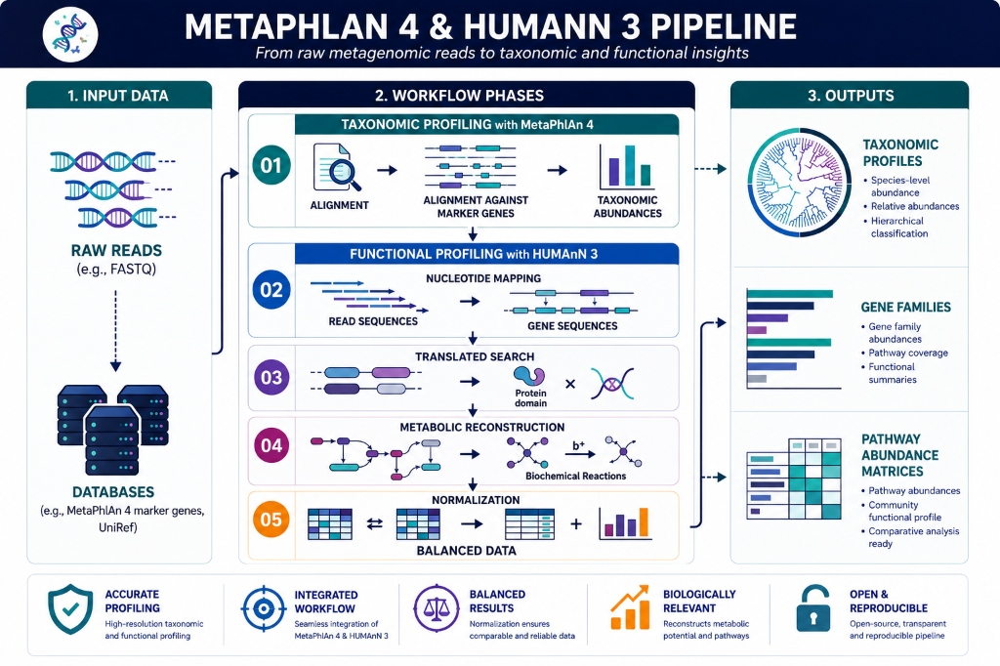

[](license)
# Taxonomic and Functional Profiling Pipeline: MetaPhlAn 4 and HUMAnN 3

This repository provides a reproducible computational framework designed for the taxonomic profiling and functional metabolic reconstruction of metagenomic shotgun sequencing reads. The pipeline automates the entire bioinformatic workflow, including environment provisioning, sequence alignment, database management, abundance normalization, and cohort-level matrix consolidation.



---

## Project Architecture

The repository is organized to maintain a clear separation between scripts, raw data, reference databases, and downstream analytical outputs:

```text
metaphlan4_humann3_microbiome_pipeline/
├── envs/
│   └── environment.yml          # Reproducible Conda/Mamba env specification
├── data/
│   ├── raw_reads/               # Metagenomic inputs (.fastq.gz, .sam, .m8) [Ignored]
│   │   └── README.md            # Directory information and download links
│   └── sample_manifest.txt      # Optional metadata mapping manifest
├── scripts/
│   ├── 00_install.sh            # Conda environment provisioning and pip setup
│   ├── 01_execute_humann.sh     # Database fetching and HUMAnN execution
│   ├── 02_renormalize_tables.sh # Normalizes abundance tables (CPM and Relative Abundance)
│   ├── 03_consolidate_cohort.sh # Merges individual samples into cohort matrices
│   ├── humann_dbs/              # Reference databases (Chocophlan, UniRef) [Ignored]
│   │   └── README.md            # Database structure documentation
│   └── README.md                # Script execution guide
├── results/                     # Structured output files [Ignored]
│   ├── gene_families/           # UniRef90 gene family abundance tables
│   ├── pathways/                # MetaCyc pathway abundance and coverage tables
│   ├── taxonomy/                # MetaPhlAn taxonomic profiles
│   └── README.md                # Output matrix documentation
├── license                      # MIT License
└── readme.md                    # Main documentation
```

---

## Quick Start

### 1. Provision the Environment
Deploy the conda environment and install dependencies. This uses `mamba` to bypass package resolver bottlenecks and configures the Python 3.10 virtual environment:
```bash
chmod +x scripts/*.sh
./scripts/00_install.sh
```

### 2. Execute the Pipeline
To execute the pipeline, activate the environment and run the main controller script.

* **Demo / Testing Mode (Default; does not require the 33GB database):**
  This mode runs the pipeline on pre-aligned SAM and m8 files, bypassing the MetaPhlAn taxonomic index:
  ```bash
  ./scripts/01_execute_humann.sh
  ```

* **Full Production Mode (Requires the 33GB MetaPhlAn Bowtie2 database):**
  To align raw FASTQ files and perform full taxonomic attribution, you must download the complete database:
  ```bash
  ./scripts/01_execute_humann.sh --full
  ```

### 3. Normalize and Consolidate Outputs
Normalize the raw RPK (Reads Per Kilobase) outputs to standard biological units (Copies Per Million [CPM] and Relative Abundance) and consolidate cohort-wide matrices:
```bash
./scripts/02_renormalize_tables.sh
./scripts/03_consolidate_cohort.sh
```

---

## Biology behind the pipeline

A biological and mathematical audit of the pipeline output was performed to ensure correct functionality:

### 1. Mathematical Validation of Gene Family Normalization
The abundance matrix `results/gene_families/demo_genefamilies_relab.tsv` was queried to verify that relative abundances sum correctly:
* **Community-level total (unstratified) sum:** **`1.0`** (representing 100% of the community metagenome).
* **Stratified + Unstratified sum:** **`2.0`**. This is the exact expected value, since every gene abundance is counted once in the community total and once in the taxonomically stratified attribution (defaulting to `unclassified` in the demo). This mathematically validates the `humann_renorm_table` execution.

### 2. Pathway Abundances and Metabolic Completeness
Querying the pathway abundance (`results/pathways/demo_pathabundance.tsv`) reveals expected proportions of:
* **`UNMAPPED`** (reads that could not be mapped to any known gene family).
* **`UNINTEGRATED`** (reads mapped to UniRef gene families that do not participate in any structured MetaCyc pathway). 
These values reflect the metabolic "dark matter" of the microbiome, which is a typical and vital control metric in metabolic reconstruction.

### 3. Taxonomic Attribution and Search Bypasses
* **In Demo Mode (No MetaPhlAn Bowtie2 index):** Taxonomic attributions default to `unclassified` because MetaPhlAn is bypassed. HUMAnN falls back to mapping genes directly to the UniRef database without species-level attribution.
* **In Full Mode:** Metagenomic reads are aligned against MetaPhlAn's marker gene database first. The resulting taxonomic profile is then used to construct a custom Chocophlan pangenome database, allowing HUMAnN to attribute metabolic pathways to specific taxonomic clades (such as `g__Bacteroides.s__Bacteroides_thetaiotaomicron`).

---

## References

* Blanco-Miguez, A., Beghini, F., Cumbo, F., McIver, L. J., Thompson, K. N., Zolfo, M., Asnicar, F., Huttenhower, C., and Segata, N. (2023). Extending and improving metagenomic taxonomic profiling with MetaPhlAn 4. Nature Biotechnology, 41(11), 1633-1644. https://doi.org/10.1038/s41587-023-01688-w
* Beghini, F., McIver, L. J., Blanco-Miguez, A., Dubois, L., Asnicar, F., Maharjan, N., Mailyan, A., Manghi, P., Scholz, M., Thomas, A. M., Sandri, M., Segata, N., and Huttenhower, C. (2021). Integrating taxonomic, functional, and strain-level profiling of diverse microbial communities with bioBakery 3. eLife, 10, e65088. https://doi.org/10.7554/eLife.65088
* Langmead, B., and Salzberg, S. L. (2012). Fast gapped-read alignment with Bowtie 2. Nature Methods, 9(4), 357-359. https://doi.org/10.1038/nmeth.1923
* Ye, Y., and Doak, T. G. (2009). A parsimony approach to biological pathway reconstruction/inference for genomes and metagenomes. PLoS Computational Biology, 5(8), e1000465. https://doi.org/10.1371/journal.pcbi.1000465

---

## License
This pipeline is released under the [MIT License](license).